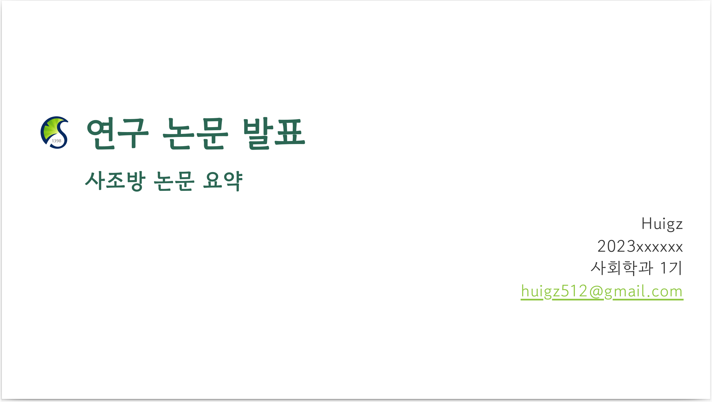

### About This Marp Theme

This is a SKKU(성균관대학과) Style Marp theme

### Prtscn



.png)

.png)

.png)

.png)

### 특성

- 환영페이지에서 학교로고 자동 기입 
    - with class 'lead'

    ```
    <!-- _class: lead -->
    ```
    - 학교 로고 자동 기입: (skku.css파일 목록에 skku_logo.jpg파일 있는지 확인하세요!)

- 목차페이지 
    - with class 'cont'
    목차페이지 예:

    ```
    <!-- _header: 목차 -->
    <!-- _class: cont -->
    설론 <pag>Page 20</pag>
    본론 <pag>Page 30</pag>
    결론 <pag>Page 40</pag>
    ```

- 한글 지원 (Google font)

### 기타

Marp-theme-academic바탕으로 Marp-theme-skku개발

Marp-theme-academic: https://github.com/kaisugi/marp-theme-academic

Marp: https://github.com/marp-team/marp


